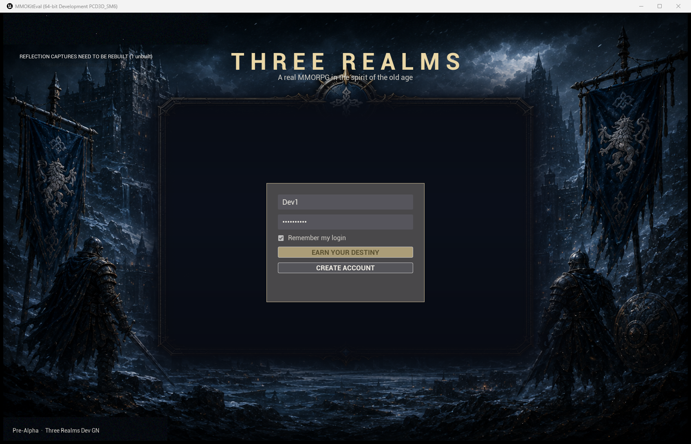

# Three Realms — State of the Game

*Updated 2026-07-02 (evening). This is the show-the-kids page.*

**Three Realms** is Dad's MMORPG: three kingdoms — the frozen **Great North**,
the magical **Mystic Lands**, and the knightly **Honorguard** — where you earn
your true class at level 10 through a quest, and the kingdoms battle for keeps
on the frontiers.

## What already works (for real, on our own server)

- **A real login screen** — the game connects to our own account server.
  This is a live screenshot from tonight, running on our machine:

  

- **Accounts and characters live in a real database.** Dad's character
  **Celtictest** logged into the world tonight — the server log says
  `Join succeeded`.
- **DAoC-style realm lock**: one account, one realm per server. The game
  *skips* realm select if your account already belongs to a realm.
- **Earned classes**: you pick a *path* (Frontline / Healer / Support /
  Damage) at creation; your true class (Knight, Bard, Ranger…) is earned at
  level 10 by questing. All from Dad's design spreadsheet — 25 classes and
  16 races per realm, 532 skills drafted.
- **A class quest**: *The Accolade* — prove yourself and become a Knight.
- **Our first zone**: **GN_Frostmarch**, a snowbound valley in the Great
  North — generated by our own tools: mountains, pine forests, a spawn
  village with a palisade and campfire, a keep on a hill, standing stones.
  (Terrain mesh is being repaired tonight — the first version imported
  broken. Game dev is like that.)
- **Skill tree window** (press K in game) that greets your character by name.
- **All the concept art** for the login / realm / race / name screens lives
  in [`design/`](../) — painted panels for each realm.

## The stack (nerd corner)

| Piece | What it is |
|---|---|
| Engine | Unreal Engine 5.7 + CodeSpartan MMO Kit (networking base) |
| World/login servers | UE dedicated server + C# persistence server (WebSocket, SQLite) |
| Design pipeline | `MMOStats.xlsx` → JSON → engine data, one command |
| Repos | this one (design), ThreeRealmsKit (game, private), ThreeRealmsPersistence (server, private) |

## Running it at home

The game project is the private **ThreeRealmsKit** repo (needs UE 5.7.4 +
Git LFS + a C++ build, plus the persistence server repo). Realistic setup is
an hour+ on a fresh machine — for a quick show-and-tell, this page and the
art in `design/` are the fastest tour; the live demo runs on the dev PC.
